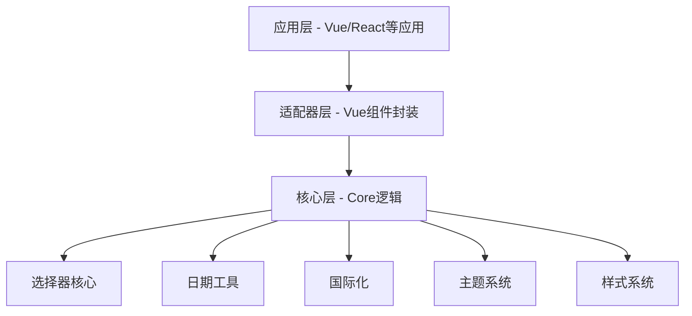
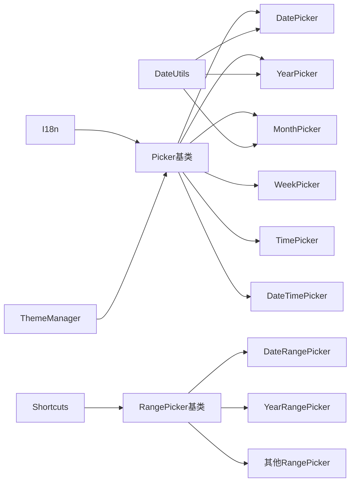
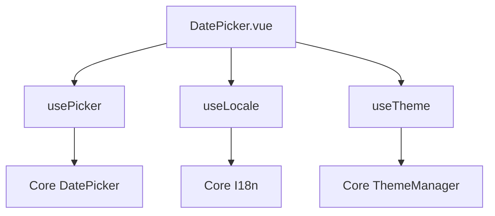
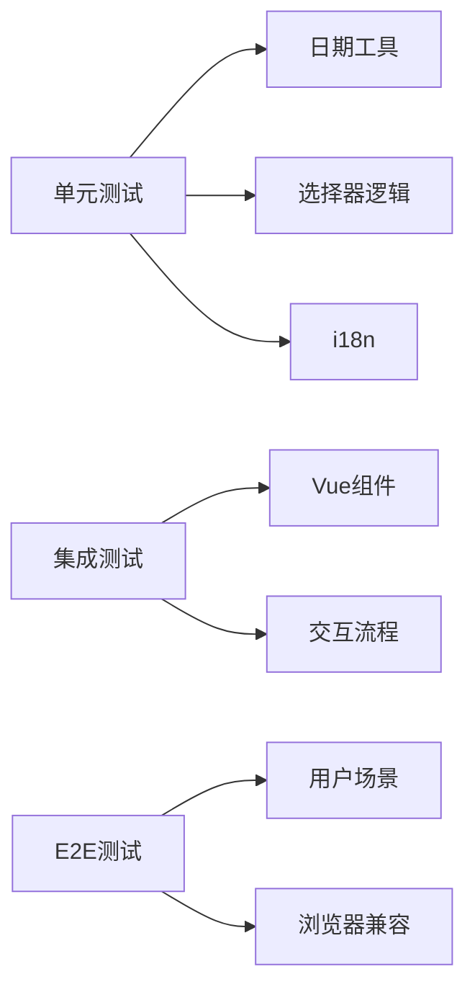
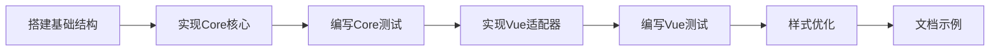

# 日期时间选择器插件 - 架构设计文档

## 📋 项目概述

功能全面、框架无关的日期时间选择器组件库。

**核心特性：**
- ✨ 支持日期、年份、月份、星期、时间及范围选择
- 🎨 现代化设计，流畅动画
- 🌍 多语言国际化支持
- 🎭 亮色/暗色主题切换
- 🔧 框架无关核心，易于适配

## 🏗️ 整体架构

### 项目结构

```
datepicker/
├── packages/
│   ├── core/          # 核心包（框架无关）
│   └── vue/           # Vue 适配器包
```

### 架构分层图



## 📦 packages/core 设计

### 目录结构

```
packages/core/
├── src/
│   ├── types/              # TypeScript 类型定义
│   ├── utils/              # 工具函数
│   │   ├── date.ts         # 日期计算
│   │   ├── format.ts       # 格式化
│   │   └── validator.ts    # 验证
│   ├── i18n/               # 国际化
│   │   └── locales/        # 语言包
│   ├── theme/              # 主题系统
│   ├── pickers/            # 选择器核心
│   │   ├── base/           # 基类
│   │   └── range/          # 范围选择
│   ├── shortcuts/          # 快捷选项
│   ├── styles/             # 样式
│   │   ├── base.css
│   │   ├── variables.css
│   │   ├── components/
│   │   └── themes/
│   └── index.ts
├── tests/
└── package.json
```

### 核心模块关系图



### 核心类型定义

```typescript
// 选择器配置
interface PickerOptions {
  locale?: string;
  theme?: 'light' | 'dark';
  disabled?: boolean;
  disabledDate?: (date: Date) => boolean;
  shortcuts?: ShortcutOption[];
  format?: string;
  placeholder?: string;
  onChange?: (value: any) => void;
}

// 主题数据
interface ThemeData {
  name: string;
  colors: Record<string, string>;
  shadows: Record<string, string>;
  borderRadius: Record<string, string>;
  spacing: Record<string, string>;
}

// 语言包
interface LocaleData {
  name: string;
  months: string[];
  weekdays: string[];
  formats: Record<string, string>;
  buttons: Record<string, string>;
}
```

## 📦 packages/vue 设计

### 目录结构

```
packages/vue/
├── src/
│   ├── components/
│   │   ├── DatePicker.vue
│   │   ├── YearPicker.vue
│   │   ├── MonthPicker.vue
│   │   ├── WeekPicker.vue
│   │   ├── TimePicker.vue
│   │   ├── DateTimePicker.vue
│   │   └── 各种RangePicker.vue
│   ├── composables/
│   │   ├── usePicker.ts
│   │   ├── useLocale.ts
│   │   └── useTheme.ts
│   └── index.ts
└── package.json
```

### Vue 组件设计



## 🎨 样式设计

### CSS 架构

- **CSS Variables** - 主题切换
- **BEM 命名** - 可维护性
- **模块化** - 组件独立
- **响应式** - 多端适配

### 样式变量示例

```css
:root {
  --ldp-primary: #1890ff;
  --ldp-bg-primary: #ffffff;
  --ldp-text-primary: rgba(0, 0, 0, 0.85);
  --ldp-border-color: #d9d9d9;
  --ldp-border-radius: 6px;
  --ldp-shadow-md: 0 4px 16px rgba(0, 0, 0, 0.12);
  --ldp-transition: all 0.3s cubic-bezier(0.4, 0, 0.2, 1);
}

[data-theme='dark'] {
  --ldp-primary: #177ddc;
  --ldp-bg-primary: #141414;
  --ldp-text-primary: rgba(255, 255, 255, 0.85);
}
```

## 🔄 功能实现要点

### 1. 日期选择器
- 日历视图
- 月份切换
- 今天高亮
- 日期禁用
- 键盘导航

### 2. 年份/月份选择器
- 面板展示
- 翻页切换
- 当前高亮

### 3. 星期选择器
- 按周展示
- 整周选择
- 周数显示

### 4. 时间选择器
- 时分秒滚动
- 12/24小时制
- 时间禁用

### 5. 日期时间选择器
- 日期+时间联动
- 分步确认

### 6. 范围选择
- 开始/结束选择
- 范围高亮
- 快捷选项

### 7. 快捷选项
预设：今天、昨天、最近7天、本周、本月等

### 8. 国际化
初期支持：zh-CN、en-US、zh-TW、ja-JP、ko-KR

### 9. 主题
- 亮色主题（默认）
- 暗色主题
- 自定义覆盖

## 🧪 测试策略



## 📈 开发流程



## 🚀 技术栈

- **开发语言**: TypeScript
- **构建工具**: Vite
- **测试框架**: Vitest + Playwright
- **包管理**: pnpm (Monorepo)
- **代码规范**: ESLint + Prettier
- **Vue版本**: Vue 3 (Composition API)

## 📝 命名规范

- **类名**: PascalCase (DatePicker)
- **函数**: camelCase (formatDate)
- **常量**: UPPER_SNAKE_CASE (DEFAULT_FORMAT)
- **CSS类**: BEM (ldp-picker__header--active)
- **CSS变量**: kebab-case (--ldp-primary-color)

## 🎯 性能优化

- 虚拟滚动（大数据量）
- 防抖/节流
- 按需加载语言包
- CSS-in-JS 避免（使用原生CSS）
- Tree-shaking 友好

## 📚 文档规划

- README.md - 快速开始
- API.md - API 文档
- EXAMPLES.md - 使用示例
- CHANGELOG.md - 更新日志
- CONTRIBUTING.md - 贡献指南